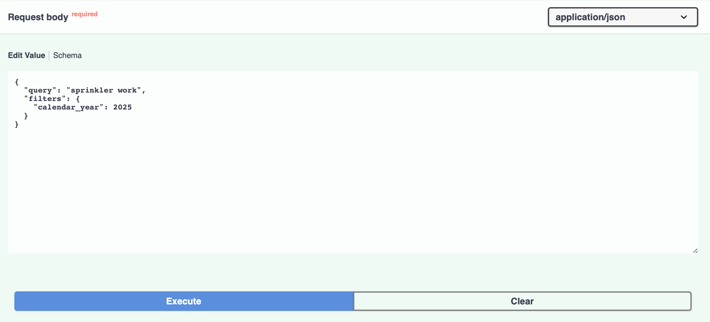

# Semantic Permit Search API

A FastAPI-based semantic search system for Austin city permits using embeddings and vector similarity search. This project enables intelligent searching through permit data using natural language queries.

## 🚀 Features

- **Semantic Search**: Find permits using natural language queries instead of exact keyword matching
- **Vector Embeddings**: Uses SentenceTransformer models for high-quality text embeddings
- **ChromaDB Integration**: Efficient vector storage and similarity search
- **Smart Filtering**: Filter results by permit type and calendar year
- **RESTful API**: Clean, documented API endpoints
- **Interactive Documentation**: Swagger UI for easy testing

## 📋 Prerequisites

- Python 3.8+
- pip or conda for package management

## 🛠️ Installation

1. **Clone the repository** (or navigate to your project directory):

   ```bash
   cd /Users/roshaan/Documents/pd_work
   ```

2. **Create and activate a virtual environment**:

   ```bash
   python -m venv venv
   source venv/bin/activate  # On Mac/Linux
   # or
   venv\Scripts\activate     # On Windows
   ```

3. **Install dependencies**:
   ```bash
   pip install -r requirements.txt
   ```

## 📊 Data Structure

The project works with Austin city permit data containing:

- **Permit Numbers**: Unique identifiers (e.g., "2025-074499 PP")
- **Permit Types**: Categories like "Plumbing Permit", "Electrical Permit"
- **Descriptions**: Detailed permit descriptions for semantic search
- **Dates**: Application, issue, and completion dates
- **Locations**: Address and geographic coordinates

### Key Files:

- `normalized_permits.json`: Clean, structured permit data
- `embedded_permits_local.json`: Permits with pre-computed embeddings
- `chroma_db/`: ChromaDB vector database storage

## 🚀 Running the Application

1. **Start the FastAPI server**:

   ```bash
   uvicorn app:app --host 127.0.0.1 --port 8000 --reload
   ```

2. **Access the application**:
   - **API Documentation**: http://127.0.0.1:8000/docs
   - **Health Check**: http://127.0.0.1:8000/healthz
   - **Statistics**: http://127.0.0.1:8000/stats

## 🔍 API Endpoints

### Health Check

```bash
curl http://127.0.0.1:8000/healthz
```

### Get Database Statistics

```bash
curl http://127.0.0.1:8000/stats
```

### Semantic Search

**Basic Search:**

```bash
curl -X POST "http://127.0.0.1:8000/search" \
  -H "Content-Type: application/json" \
  -d '{
    "query": "irrigation system installation"
  }'
```

**Search with Filters:**

```bash
curl -X POST "http://127.0.0.1:8000/search" \
  -H "Content-Type: application/json" \
  -d '{
    "query": "electrical work",
    "filters": {
      "permit_type": "Electrical Permit",
      "calendar_year": 2025
    }
  }'
```

### Pretty Output (with jq)

```bash
curl -X POST "http://127.0.0.1:8000/search" \
  -H "Content-Type: application/json" \
  -d '{
    "query": "plumbing repair"
  }' | jq '.'
```



![results]](image-1.png)

## 📝 Example Queries

The system understands natural language and finds semantically similar permits:

- **"irrigation system"** → Finds permits for lawn sprinklers, drip systems, landscape watering
- **"electrical work"** → Finds permits for wiring, lighting, electrical installations
- **"sign installation"** → Finds permits for business signs, illuminated signs, wall signs
- **"plumbing repair"** → Finds permits for pipe work, water system installations

## 🏗️ Project Structure

```
pd_work/
├── app.py                          # Main FastAPI application
├── requirements.txt                # Python dependencies
├── normalized_permits.json         # Clean permit data
├── embedded_permits_local.json     # Permits with embeddings
├── chroma_db/                      # Vector database storage
├── top_20_rows.json               # Sample data subset
├── normalize.py                    # Data normalization script
├── extract.py                     # Data extraction utilities
└── README.md                      # This file
```

## 🧠 How It Works

1. **Data Processing**: Raw permit data is normalized and cleaned
2. **Embedding Generation**: Text descriptions are converted to vector embeddings using SentenceTransformer
3. **Vector Storage**: Embeddings are stored in ChromaDB for efficient similarity search
4. **Query Processing**: User queries are embedded and compared against stored vectors
5. **Similarity Ranking**: Results are ranked by cosine similarity and returned

## 🔧 Configuration

Key configuration variables in `app.py`:

- `NORMALIZED_DATA_PATH`: Path to normalized permit data
- `CHROMA_DIR`: ChromaDB storage directory
- `COLLECTION_NAME`: Name of the vector collection

## 🎯 Use Cases

- **Contractors**: Find similar permits for reference
- **City Planners**: Analyze permit patterns and trends
- **Residents**: Research permit requirements for projects
- **Developers**: Build applications on top of permit data

## 🚨 Error Handling

The API includes robust error handling:

- Automatic fallback to unfiltered search if no matches found
- Graceful handling of missing data
- Detailed error messages for debugging

## 🔍 Search Tips

- Use descriptive terms related to the work being done
- Try different phrasings if you don't get expected results
- Combine semantic search with filters for more precise results
- The system works best with construction/permit-related terminology

## 📈 Performance

- **Embedding Model**: `all-MiniLM-L6-v2` (384 dimensions)
- **Vector Database**: ChromaDB with cosine similarity
- **Search Speed**: Sub-second response times for typical queries
- **Dataset Size**: 20 permits (sample), easily scalable to thousands

## 🤝 Contributing

1. Fork the repository
2. Create a feature branch
3. Make your changes
4. Test thoroughly
5. Submit a pull request

## 📄 License

This project is for educational and research purposes. Please respect data usage policies for Austin city permit data.

## 🆘 Troubleshooting

**Server won't start:**

- Check if port 8000 is available
- Ensure all dependencies are installed
- Verify ChromaDB path exists and is writable

**No search results:**

- Check if ChromaDB contains data
- Try broader search terms
- Remove filters to see if data exists

**Poor search quality:**

- Consider retraining embeddings
- Check data quality and descriptions
- Experiment with different embedding models
